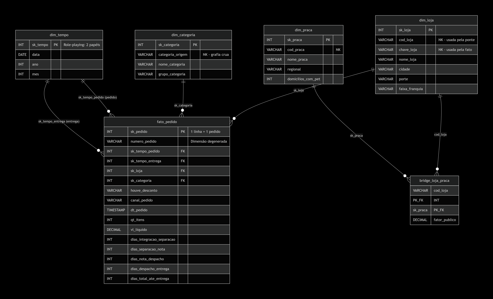

# ELT + Star Schema — Pata Amiga


> Pipeline ELT em PostgreSQL que transforma dados sujos de 3 sistemas legados
> em um modelo dimensional estrela, respondendo 5 perguntas de negócio sobre
> entregas, faturamento, descontos e expansão de uma rede de 32 pet shops.

## Sumário

- [1. Explicação do Case](#1-explicação-do-case)
- [2. Descrição do Modelo Construído](#2-descrição-do-modelo-construído)
- [3. Decisões Tomadas](#3-decisões-tomadas)
- [4. Estrutura do Repositório](#4-estrutura-do-repositório)
- [5. Como Executar](#5-como-executar)
- [6. Diagnóstico da Origem](#6-diagnóstico-da-origem)
- [7. Dimensões Customizadas](#7-dimensões-customizadas)
- [8. Carga da Fato](#8-carga-da-fato)
- [9. Respostas das 5 Perguntas de Negócio](#9-respostas-das-5-perguntas-de-negócio)
- [10. Validações Realizadas](#10-validações-realizadas)
- [11. Limitações dos Dados](#11-limitações-dos-dados)
- [12. Melhorias Futuras](#12-melhorias-futuras)
- [13. Segurança e LGPD](#13-segurança-e-lgpd)
- [14. Tecnologias Utilizadas](#14-tecnologias-utilizadas)
- [15. Vídeo de Apresentação](#15-vídeo-de-apresentação)
- [16. Autora](#16-autora)
- [PRD (complementar)](docs/PRD.md) — escopo, personas e aceite; números e construção ficam neste README

---

## 1. Explicação do Case

### 1.1 Contexto

A Pata Amiga é uma rede catarinense de pet shops fundada em 2009, com 32 lojas espalhadas pelo estado. Em setembro de 2023, a rede integrou pedidos de múltiplos canais (*app*, site, telefone, WhatsApp e loja física). Em 7 meses, foram 4.044 pedidos.

### 1.2 O Problema

Os dados estão dispersos em três sistemas que não conversam entre si:

- **Plataforma de *e-commerce*** — pedidos e marcos da entrega;
- **Cadastro de *franchising*** — dados das 32 lojas;
- **Planilha de expansão** — praças de atendimento.

Cada sistema escreve do seu jeito: grafias variadas de loja, categorias com múltiplas formas, datas e valores como texto.

### 1.3 As 5 Perguntas de Negócio

- **P1:** Onde está o gargalo da entrega?
- **P2:** Qual categoria concentra o faturamento?
- **P3:** O desconto funciona igual em todo canal?
- **P4:** Qual praça concentra o faturamento?
- **P5:** Onde abrir a próxima loja (e o que os dados **não** permitem afirmar)?

### 1.4 O Desafio Técnico

Construir o modelo dimensional que torna as 5 perguntas respondíveis, a partir de dados sujos, sem alterar a área de *staging*.

---

## 2. Descrição do Modelo Construído

### 2.1 Arquitetura ELT

O projeto segue o paradigma **ELT** (Extract, Load, Transform):

1. **Extract** — dados extraídos dos sistemas legados;
2. **Load** — carregados crus na área de *staging* (script 01);
3. **Transform** — transformados dentro do PostgreSQL via SQL (scripts 04 e 05).

**Por que ELT e não ETL:** a transformação ocorre **dentro do banco**, usando SQL puro, sem ferramentas externas.

### 2.2 Diagrama do Modelo Estrela



O modelo segue o padrão **estrela (star schema)**: a `fato_pedido` no centro e as dimensões ao redor.

#### 2.2.1. Fato central

- **`fato_pedido`** — grão: **1 linha = 1 pedido** (4.044 linhas);
- Contém as métricas aditivas (`vl_liquido`, `qt_itens`), os atributos de contexto (`houve_desconto`, `canal_pedido`, `dt_pedido`) e as 5 colunas de dias do processo;
- Guarda também a **dimensão degenerada** `numero_pedido` (código sem atributos).

O detalhamento completo da fato está na [seção 8](#8-carga-da-fato).

#### 2.2.2. Dimensões

- **`dim_tempo`** — usada em **dois papéis** (*role-playing dimension*): data do pedido (`sk_tempo_pedido`) e data da entrega (`sk_tempo_entrega`);
- **`dim_loja`** — encontrada pelo nome padronizado (`chave_loja`);
- **`dim_categoria`** — encontrada pela grafia crua (`categoria_origem`);
- **`dim_praca`** — acessada **indiretamente**, via `bridge_loja_praca` (não se liga direto à fato).

O detalhamento das dimensões customizadas está na [seção 7](#7-dimensões-customizadas).

#### 2.2.3. Caminho indireto (único do modelo)

A **`bridge_loja_praca`** resolve a relação **N:N** entre loja e praça e carrega o **fator de rateio** (`fator_publico`, soma 1,00 por loja).

#### 2.2.4. Chaves

- Todas as dimensões têm **surrogate key** (`sk_*`) como PK;
- As **chaves naturais** (`cod_loja`, `cod_praca`, `categoria_origem`) ficam como atributos e são usadas nos JOINs;
- A `bridge_loja_praca` tem **PK composta** `(cod_loja, sk_praca)` — usa a chave natural da loja, não a surrogate;
- Toda dimensão tem a **linha -1 = "Nao Informado"**, garantindo que nenhuma FK na fato fique nula.

### 2.3 Estrutura do Modelo

| Camada | Tabela | Linhas |
|--------|--------|--------|
| Fato | `fato_pedido` | 4.044 |
| Dimensões prontas | `dim_tempo` / `dim_loja` | 236 / 33 |
| Dimensões customizadas | `dim_categoria` / `dim_praca` | 38 / 13 |
| Bridge | `bridge_loja_praca` | 48 |

### 2.4 Características do Modelo

- **Role-playing dimension:** `dim_tempo` usada 2x (pedido e entrega);
- **Dimensão degenerada:** `numero_pedido` (sem atributos, fica na fato);
- **Bridge table:** único caminho indireto (`fato → dim_loja → bridge → dim_praca`);
- **Linha -1** em todas as dimensões: nenhuma FK nula;
- **Grão:** 1 linha = 1 pedido.

### 2.5 Fluxo dos Dados

```text
staging (sujas) → dimensões prontas + customizadas + ponte → fato → análises
```

---

## 3. Decisões Tomadas

### 3.1 Decisões de Modelagem

| Decisão | Justificativa |
|---------|---------------|
| Star schema (não snowflake) | Simplicidade e performance |
| Bridge table para loja × praça | Relação N:N não cabe em FK |
| Fato com grão de 1 pedido | Permite todas as 5 análises |
| `dim_tempo` com 2 papéis | Pedido e entrega usam a mesma dimensão |
| UMA coluna de dinheiro (`vl_liquido`) | Valor bruto e desconto não são usados nas perguntas |
| Dimensão degenerada (`numero_pedido`) | Código sem atributos, permanece na fato |

### 3.2 Decisões de Tratamento

| Decisão | Justificativa |
|---------|---------------|
| Máscara `MM/DD/YYYY HH12:MI AM` | Data do pedido em formato americano |
| `::date` nos marcos | Formato ISO |
| `CASE WHEN` com MED antes de RA | "Ração Medicamentosa" é medicamento |
| `CASE WHEN` com WHATS antes de APP | "WHATSAPP" contém "APP" |
| `UPPER` + `TRANSLATE` (36 caracteres, incl. cedilha) + `REPLACE` no nome da loja | Normalizar antes do lookup |
| `COALESCE(..., -1)` nas FKs | Linha -1 em vez de FK nula |
| Marco em branco → NULL nos dias | `AVG` ignora NULL, mas soma 0 |
| `100.0` nas divisões | Evitar truncamento de inteiro. No PostgreSQL, `INT / INT` retorna `INT` (trunca). Usar `100.0` (com ponto) força o resultado decimal — sem isso, os percentuais da P2, P3 e P4 sairiam zerados. |
| `LEFT JOIN` em vez de subconsulta | Seguir o padrão do documento |

### 3.3 Decisões de Segurança e Boas Práticas

| Decisão | Justificativa |
|---------|---------------|
| Sem UPDATE/ALTER na staging | Staging é imutável |
| Apenas SELECT nas staging | Tratamento nos INSERTs das dimensões e fato |
| Sem CTE, window function, trigger, índice | Lista fechada de comandos do documento |
| Sem view ou tabela intermediária | Apenas as tabelas do modelo |
| Subconsulta só nas análises | Documento permite |
| Constraints FK formais | Garantir integridade referencial |

### 3.4 Decisão sobre `TRANSLATE` com Unicode escapes

- O documento sugere `TRANSLATE` para remover acentos;
- Usamos `TRANSLATE` com **Unicode escapes** (`U&'\00C1...'`) em vez de acentos literais, para:
  - Seguir o documento (sem precisar de extensão `unaccent`);
  - Evitar erros de codificação (o arquivo fica 100% ASCII);
  - Garantir portabilidade em qualquer ambiente PostgreSQL;
- A lista cobre **36 caracteres** (18 maiúsculos + 18 minúsculos), incluindo **cedilha** (`Ç`/`ç`);
- O resultado funcional é idêntico ao `UNACCENT`, mas sem dependência externa.

---

## 4. Estrutura do Repositório

```text
elt-star-schema/
│
├── README.md                              # Documento principal (este arquivo)
├── .gitignore                             # Arquivos ignorados pelo Git
│
├── scripts_sql/                           # Scripts SQL na ordem de execução
│   ├── 00-conferencia.sql                 # Auxiliar: validação entre etapas
│   ├── 01-carga-staging.sql               # Pipeline: carga das 3 tabelas de origem
│   ├── 02-dimensoes-prontas.sql           # Pipeline: dim_tempo e dim_loja + criação das demais
│   ├── 03-diagnostico.sql                 # Auxiliar: raio-X da origem
│   ├── 04-dimensoes-customizadas.sql      # Pipeline: dim_categoria, dim_praca, bridge
│   ├── 05-carga-fato.sql                  # Pipeline: carga da fato_pedido (4.044 linhas)
│   └── 06-analises.sql                    # Pipeline: consultas das 5 perguntas de negócio
│
├── assets/                                # Imagens e diagramas
│   └── diagrama-estrela.png               # Diagrama do modelo estrela
│
└── docs/                                  # Documentação complementar
    └── PRD.md                             # Product Requirements Document
```

---

## 5. Como Executar

### 5.1. Pré-requisitos

- PostgreSQL 16 ou superior instalado e rodando;
- Cliente SQL (psql ou pgAdmin);
- Os 7 scripts da pasta `scripts_sql/`.

### 5.2. Ordem de execução

**Pipeline de construção do modelo** (executar na ordem):

| Ordem | Script | Banco | O que faz |
|-------|--------|-------|-----------|
| 1º | `01-carga-staging.sql` | `postgres` | Cria o banco `dw_pata_amiga` e carrega as 3 tabelas de staging |
| 2º | `02-dimensoes-prontas.sql` | `dw_pata_amiga` | Popula `dim_tempo` (236) e `dim_loja` (33); cria as demais tabelas vazias |
| 3º | `04-dimensoes-customizadas.sql` | `dw_pata_amiga` | Cria e carrega `dim_categoria` (38), `dim_praca` (13) e `bridge_loja_praca` (48) |
| 4º | `05-carga-fato.sql` | `dw_pata_amiga` | Cria e carrega a `fato_pedido` (4.044 linhas) |
| 5º | `06-analises.sql` | `dw_pata_amiga` | Responde as 5 perguntas de negócio |

**Scripts auxiliares** (não fazem parte do pipeline — podem rodar a qualquer momento, sem risco de quebrar o modelo):

| Script | Quando rodar | O que faz |
|--------|--------------|-----------|
| `00-conferencia.sql` | Entre etapas | Valida se os números esperados batem antes de avançar |
| `03-diagnostico.sql` | Após o `01` | Raio-X da origem: coleta as contagens que sustentam a [seção 6](#6-diagnóstico-da-origem) |

> **Sobre os scripts auxiliares:**
>
> Nenhum dos dois cria ou altera tabelas do modelo. O `00-conferencia.sql` é um **validador** — roda entre as etapas para conferir se os números batem com o esperado. O `03-diagnostico.sql` é um **raio-X da origem**: percorre as três tabelas de *staging* e devolve as contagens que sustentam o diagnóstico deste README — quantas grafias distintas de loja e de categoria existem, quantos pedidos vieram sem código ou sem nome de loja, quantos marcos de processo estão em branco. É o que dá base numérica à [seção 6](#6-diagnóstico-da-origem) e permite afirmar que os defeitos plantados são reais, não suposições.

### 5.3. Observação sobre a numeração dos scripts

O documento original numera os scripts do pipeline de `00` a `05`. Neste repositório, foi adicionado o script **auxiliar** `03-diagnostico.sql` (que não faz parte do pipeline, mas ocupa o número 3 por ordem lógica de execução). Isso deslocou a numeração dos scripts seguintes:

| Documento original | Neste repositório |
|--------------------|-------------------|
| `03-dimensoes-customizadas.sql` | `04-dimensoes-customizadas.sql` |
| `04-carga-fato.sql` | `05-carga-fato.sql` |
| `05-analises.sql` | `06-analises.sql` |

O conteúdo é o mesmo — apenas a numeração foi deslocada.

### 5.4. Execução via psql

```powershell
# Pipeline de construção
psql -U postgres -d postgres -f "scripts_sql/01-carga-staging.sql"

psql -U postgres -d dw_pata_amiga -f "scripts_sql/02-dimensoes-prontas.sql"
psql -U postgres -d dw_pata_amiga -f "scripts_sql/04-dimensoes-customizadas.sql"
psql -U postgres -d dw_pata_amiga -f "scripts_sql/05-carga-fato.sql"
psql -U postgres -d dw_pata_amiga -f "scripts_sql/06-analises.sql"

# Scripts auxiliares (opcionais)
psql -U postgres -d dw_pata_amiga -f "scripts_sql/03-diagnostico.sql"
psql -U postgres -d dw_pata_amiga -f "scripts_sql/00-conferencia.sql"
```

### 5.5. Execução via pgAdmin

1. Conecte ao servidor com o usuário `postgres`;
2. Abra o **Query Tool** no banco `postgres`;
3. Execute o `01-carga-staging.sql` (**F5**);
4. Atualize a árvore e localize o banco `dw_pata_amiga`;
5. Abra o **Query Tool** nele para os scripts 02, 04, 05 e 06.

> **Atenção:** o script `01` contém o comando `\c dw_pata_amiga`, que só funciona no `psql`. No pgAdmin, remova essa linha ou execute em duas partes (criação do banco, depois carga).

### 5.6. Validação

Após cada etapa, rode o bloco correspondente do `00-conferencia.sql` para conferir se os números batem com o esperado. Os 16 números de conferência estão na [seção 10](#10-validações-realizadas).

O `03-diagnostico.sql` gera as contagens da [seção 6](#6-diagnóstico-da-origem) — recomenda-se rodá-lo após o `01`, quando a *staging* já está carregada.

---

## 6. Diagnóstico da Origem

Os números abaixo vêm do script `03-diagnostico.sql`, que percorre as três tabelas de *staging* sem alterá-las. Ele é o raio-X que sustenta todo o tratamento aplicado nas etapas seguintes.

### 6.1. Números gerais

| Tabela | Linhas |
|--------|--------|
| `stg_pedido` | 4.044 |
| `stg_loja` | 32 |
| `stg_loja_praca` | 48 |

### 6.2. O que está errado com cada tabela

#### `stg_pedido`

| Defeito | Onde | Impacto |
|---------|------|---------|
| Todas as colunas são texto (VARCHAR) | Toda a tabela | Datas, valores e quantidades não podem ser calculados |
| Nomes fora de snake_case | `"Cod Loja"`, `"QTD.Itens"` | Exigem aspas duplas no SQL |
| Dois formatos de data | `"DtHoraPedido"` (MM/DD/YYYY) e marcos (YYYY-MM-DD) | Máscaras diferentes por coluna |
| 37 grafias de categoria | `"CategoriaProduto"` | 7 categorias reais escondidas atrás de variações |
| Pegadinha "Ração Medicamentosa" | `"CategoriaProduto"` | Se testar RA antes de MED, classifica errado |
| 128 grafias de loja | `"Loja-Nome"` | 32 lojas reais com dezenas de variações |
| 1.575 pedidos sem `Cod Loja` (~39%) | `"Cod Loja"` | Precisa resolver pelo nome |
| 3 pedidos sem nome de loja | `"Loja-Nome"` | Vão para a linha -1 |
| 17 grafias de desconto | `"HouveDesconto"` | 3 valores reais |
| 20 grafias de canal | `"CanalPedido"` | 6 valores reais |
| Números em formatos misturados | `"ValorLiquidoPedido(R$)"`, `"QTD.Itens"` | R$, vírgula, ponto, traço |
| 1.953 entregas não concluídas | `"DtEntregaCliente"` | Marco em branco = processo aberto |

#### `stg_loja`

| Defeito | Onde | Impacto |
|---------|------|---------|
| Faixa de franquia é a foto de hoje | `"FaixaFranquia"` | O passado foi sobrescrito (limita a P5) |

#### `stg_loja_praca`

| Defeito | Onde | Impacto |
|---------|------|---------|
| Relação N:N entre loja e praça | Toda a tabela | Não cabe em FK — precisa de bridge table |
| Fator de público em texto | `"PercentualPublico"` | Precisa conversão para decimal |
| Domicílios com pet com ponto de milhar | `"DomiciliosComPet"` | Precisa conversão para inteiro |

### 6.3. Os 5 itens solicitados no documento oficial

| Item | Quantidade |
|------|------------|
| Grafias distintas de loja | 128 |
| Grafias distintas de categoria | 37 |
| Pedidos sem código de loja | 1.575 (~39%) |
| Pedidos sem nome de loja | 3 |
| Marcos de processo em branco | 1.077 / 1.338 / 1.665 / 1.953 |

### 6.4. Marcos de processo em branco

| Marco | Quantidade | Significado |
|-------|------------|-------------|
| `Dt Separacao Estoque` | 1.077 | Processo em aberto |
| `DtNotaFiscal` | 1.338 | Processo em aberto |
| `Dt_Despacho_Transportadora` | 1.665 | Processo em aberto |
| `DtEntregaCliente` | 1.953 | Processo em aberto |

### 6.5. Tratamentos aplicados

| Defeito | Tratamento | Script |
|---------|------------|--------|
| Colunas em texto | `CAST` / `TO_TIMESTAMP` / `::date` / `::int` | 04 e 05 |
| Nomes fora de snake_case | Uso entre aspas duplas (`"Cod Loja"`) | 04 e 05 |
| Dois formatos de data | `TO_TIMESTAMP(..., 'MM/DD/YYYY HH12:MI AM')` e `::date` | 05 |
| 37 grafias de categoria | `UPPER` + `TRANSLATE` (36 caracteres, incl. cedilha) + `CASE WHEN` (MED antes de RA) + grafia crua em `categoria_origem` | 04 |
| Pegadinha "Ração Medicamentosa" | Ordem do CASE: MED primeiro | 04 |
| 128 grafias de loja | `UPPER` + `TRANSLATE` (36 caracteres, incl. cedilha) + `REPLACE('/SC')` + `REPLACE('  ', ' ')` + CASE para 3 erros | 05 |
| 1.575 sem `Cod Loja` | JOIN pela `chave_loja` (derivada do nome) | 05 |
| 3 sem nome de loja | `COALESCE(..., -1)` → linha -1 | 05 |
| 17 grafias de desconto | `CASE WHEN` → Sim / Nao / Nao Informado | 05 |
| 20 grafias de canal | `CASE WHEN` com ordem correta (WHATS antes de APP) | 05 |
| Números misturados | Regra dos números (R$, vírgula, ponto, traço → NULL) | 05 |
| Marco em branco | FK → -1 e dias → NULL | 05 |
| Relação N:N | `bridge_loja_praca` com `fator_publico` | 04 |
| Faixa de franquia | Documentado como limitação (não tratável) | — |

### 6.6. Interpretação

1. **128 grafias de loja para 32 lojas reais** — a mesma loja aparece escrita de dezenas de maneiras (acentos, caixa alta, erros de digitação, sufixos);
2. **37 grafias de categoria para 7 categorias reais** — inclui variações como "Ração", "RACAO", "Rac." e a pegadinha "Ração Medicamentosa";
3. **1.575 pedidos sem código de loja (~39%)** — o código é recuperado pelo nome da loja;
4. **3 pedidos sem nome de loja** — vão para a linha -1;
5. **Marcos em branco** — representam processos ainda em aberto (não são erros) e são tratados como NULL nos campos de dias.

---

## 7. Dimensões Customizadas

### 7.1. O que foi criado

| Tabela | Linhas | Descrição |
|--------|--------|-----------|
| `dim_categoria` | 38 | 37 grafias + linha -1 |
| `dim_praca` | 13 | 12 praças + linha -1 |
| `bridge_loja_praca` | 48 | Relação loja × praça com fator de rateio |

### 7.2. `dim_categoria`

| Coluna | Tipo | Papel |
|--------|------|-------|
| `sk_categoria` | INT IDENTITY | **PK** (surrogate key) |
| `categoria_origem` | VARCHAR(50) | Chave natural (grafia crua) |
| `nome_categoria` | VARCHAR(30) | Nome padronizado |
| `grupo_categoria` | VARCHAR(20) | Alimentacao / Saude e Higiene / Bem-estar |

**Transformações aplicadas:**
- De-para com `CASE WHEN` na ordem lógica correta (MED antes de RA);
- Comparação com `UPPER` + `TRANSLATE` (36 caracteres, incl. cedilha);
- Grafia crua preservada em `categoria_origem` para o JOIN da fato.

**Linha -1:** `sk_categoria = -1` (`Nao Informado`).

### 7.3. `dim_praca`

| Coluna | Tipo | Papel |
|--------|------|-------|
| `sk_praca` | INT IDENTITY | **PK** (surrogate key) |
| `cod_praca` | VARCHAR(10) | Chave natural (usada pela ponte) |
| `nome_praca` | VARCHAR(60) | Atributo |
| `regional` | VARCHAR(30) | Atributo |
| `domicilios_com_pet` | INT | Cruzamento da P4 |

**Transformações aplicadas:**
- Conversão de `domicilios_com_pet` de texto para inteiro (remoção do ponto de milhar).

**Linha -1:** `sk_praca = -1` (`Nao Informado`).

### 7.4. `bridge_loja_praca`

| Coluna | Tipo | Papel |
|--------|------|-------|
| `cod_loja` | VARCHAR(10) | **PK composta** (chave natural da loja) |
| `sk_praca` | INT | **PK composta** (FK → `dim_praca`) |
| `fator_publico` | DECIMAL(6,4) | Fator de rateio (soma 1,00 por loja) |

**Transformações aplicadas:**
- Conversão de `PercentualPublico` de texto para decimal;
- Ligação via `cod_loja` (chave natural), não `sk_loja`.

**Sem linha -1** (não é dimensão).

**Uso:** na P4, multiplica o faturamento da loja pelo fator antes de somar por praça. Sem isso, o faturamento de quem atende duas praças seria contado duas vezes e a soma estouraria o total da rede.

### 7.5. Validações

- Soma do fator de público por loja = 1,00;
- PK composta na ponte: `(cod_loja, sk_praca)`;
- Linha -1 presente em ambas as dimensões.

---

## 8. Carga da Fato

### 8.1. O que foi criado

| Tabela | Linhas | Descrição |
|--------|--------|-----------|
| `fato_pedido` | 4.044 | Grão: 1 linha = 1 pedido |

### 8.2. Estrutura da `fato_pedido`

| Coluna | Tipo | Papel |
|--------|------|-------|
| `sk_pedido` | INT IDENTITY | **PK** |
| `numero_pedido` | VARCHAR(20) | Dimensão degenerada |
| `sk_tempo_pedido` | INT | **FK** → `dim_tempo` (papel pedido) |
| `sk_tempo_entrega` | INT | **FK** → `dim_tempo` (papel entrega) |
| `sk_loja` | INT | **FK** → `dim_loja` |
| `sk_categoria` | INT | **FK** → `dim_categoria` |
| `houve_desconto` | VARCHAR(15) | Atributo (`Sim` / `Nao` / `Nao Informado`) |
| `canal_pedido` | VARCHAR(20) | Atributo (`App` / `Site` / `Loja Fisica` / `Telefone` / `WhatsApp` / `Nao Informado`) |
| `dt_pedido` | TIMESTAMP | Atributo |
| `qt_itens` | INT | Métrica aditiva |
| `vl_liquido` | DECIMAL(15,2) | Métrica aditiva (única coluna de dinheiro) |
| `dias_integracao_separacao` | INT | Métrica calculada |
| `dias_separacao_nota` | INT | Métrica calculada |
| `dias_nota_despacho` | INT | Métrica calculada |
| `dias_despacho_entrega` | INT | Métrica calculada |
| `dias_total_ate_entrega` | INT | Métrica calculada (resposta direta da P1) |

### 8.3. Transformações aplicadas

| Transformação | Como foi feita | Coluna de origem |
|---------------|----------------|------------------|
| Datas do pedido | `TO_TIMESTAMP(..., 'MM/DD/YYYY HH12:MI AM')` → `TO_CHAR(..., 'YYYYMMDD')::int` | `"DtHoraPedido"`, `"DtHoraIntegracaoERP"` |
| Datas dos marcos | `<coluna>::date` | 4 marcos |
| Nome da loja | `UPPER` + `TRANSLATE` (36 caracteres, incl. cedilha) + `REPLACE('/SC')` + `REPLACE('  ', ' ')` + `CASE` para 3 erros | `"Loja-Nome"` |
| Categoria | `LEFT JOIN dim_categoria` pela grafia crua | `"CategoriaProduto"` |
| Valores monetários | Regra dos números | `"ValorLiquidoPedido(R$)"` |
| Quantidade de itens | `CAST` com vazio/`-` → NULL | `"QTD.Itens"` |
| Desconto | `CASE WHEN` (6 → Sim, 5 → Nao, resto → Nao Informado) | `"HouveDesconto"` |
| Canal | `CASE WHEN` (WHATS antes de APP) | `"CanalPedido"` |
| 5 colunas de dias | `<data_fim>::date - <data_inicio>::date` | marcos do processo |
| Marco em branco | FK → `-1`; dias → `NULL` | todos os marcos |
| FKs ausentes | `COALESCE(..., -1)` | `sk_loja`, `sk_categoria` |

### 8.4. As 5 colunas de dias

| Coluna | Marco de início | Marco de fim |
|--------|-----------------|--------------|
| `dias_integracao_separacao` | `DtHoraIntegracaoERP` | `Dt Separacao Estoque` |
| `dias_separacao_nota` | `Dt Separacao Estoque` | `DtNotaFiscal` |
| `dias_nota_despacho` | `DtNotaFiscal` | `Dt_Despacho_Transportadora` |
| `dias_despacho_entrega` | `Dt_Despacho_Transportadora` | `DtEntregaCliente` |
| `dias_total_ate_entrega` | `DtHoraIntegracaoERP` | `DtEntregaCliente` |

**As quatro primeiras são os intervalos do processo. A última é o TOTAL — é ela que responde à P1.**

### 8.5. Constraints aplicadas

| Constraint | Referência |
|------------|------------|
| `fk_fato_tempo_pedido` | `dim_tempo(sk_tempo)` |
| `fk_fato_tempo_entrega` | `dim_tempo(sk_tempo)` |
| `fk_fato_loja` | `dim_loja(sk_loja)` |
| `fk_fato_categoria` | `dim_categoria(sk_categoria)` |

### 8.6. O que NÃO entrou na fato (e por quê)

A `stg_pedido` traz outras colunas que **não são usadas por nenhuma das 5 perguntas**:

| Coluna da staging | Motivo para não entrar |
|-------------------|------------------------|
| `"ValorBrutoPedido(R$)"` | Nenhuma pergunta usa |
| `"Valor Desconto (R$)"` | Nenhuma pergunta usa |
| `"Qtd Unidades Devolvidas"` | Nenhuma pergunta usa |
| `"NrItensCancelados"` | Nenhuma pergunta usa |
| `"Peso Total (kg)"` | Nenhuma pergunta usa |
| `"Valor Frete (R$)"` | Nenhuma pergunta usa |
| `"FormaPagamento"`, `"Bairro Entrega"`, `"TransportadoraResponsavel"`, `"SituacaoPedido"`, `"OBS"` | Não usados nas análises |

Escolher o que **não** entra na fato também é modelagem. Há apenas UMA coluna de dinheiro (`vl_liquido`), não três.

### 8.7. Validações

| Validação | Esperado | Obtido |
|-----------|----------|--------|
| Total da fato | 4.044 | ✅ |
| FKs nulas | 0 | ✅ |
| FKs órfãs | 0 | ✅ |
| Pedidos sem loja (`sk_loja = -1`) | 3 | ✅ |
| Entregas não concluídas (`sk_tempo_entrega = -1`) | 1.953 | ✅ |
| Período dos pedidos | 01/09/2023 a 31/03/2024 | ✅ |
| Dias negativos | 0 | ✅ |
| WhatsApp na fato | 414 pedidos | ✅ |
| Desconto padronizado | 3 valores | ✅ |
| Canal padronizado | 6 valores | ✅ |
| Duplicidade de `numero_pedido` | Nenhuma | ✅ |

---

## 9. Respostas das 5 Perguntas de Negócio

### Resumo

| # | Pergunta | Resposta curta |
|---|----------|----------------|
| P1 | Gargalo da entrega | Nota → Despacho (4,11 dias) |
| P2 | Categoria campeã | Racao (60,01%) |
| P3 | Desconto por canal | Ticket COM desconto é maior em todos |
| P4 | Praça concentradora | Vale do Itajai (35,36%) |
| P5 | Próxima loja | Cidades médias com boa eficiência |

### P1: Onde está o gargalo da entrega?

**Tempo médio total:** **9,00 dias** entre o pedido entrar no ERP e chegar ao cliente.

| Intervalo | Tempo médio (dias) |
|-----------|-------------------|
| Integração → Separação | 2,13 |
| Separação → Nota | 0,64 |
| **Nota → Despacho** | **4,11** |
| Despacho → Entrega | 2,14 |

O intervalo **Nota → Despacho** é o mais lento, com **4,11 dias** — representa quase a metade do tempo total.

**O gargalo não está na entrega final, e sim entre a emissão da nota fiscal e o despacho para a transportadora.**

#### Gargalo por porte de loja

| Porte | Integração → Separação | Separação → Nota | Nota → Despacho | Despacho → Entrega | Total |
|-------|----------------------|------------------|-----------------|--------------------|-------|
| Pequena | 3,02 | 0,69 | **8,53** | 2,86 | 15,16 |
| Média | 1,98 | 0,62 | **3,34** | 2,03 | 7,95 |
| Grande | 1,96 | 0,64 | **3,32** | 2,01 | 7,93 |

O gargalo é **o mesmo nos três portes**, mas nas lojas **Pequenas** o problema é muito mais grave: tempo total quase o dobro (15,16 dias) e Nota → Despacho em 8,53 dias (contra ~3,3 das demais).

**Recomendação:**
1. **Foco imediato nas lojas Pequenas** — o processo está travando;
2. Investigar por que levam 8,5 dias para despachar após a nota;
3. Nas Médias e Grandes, o gargalo é o mesmo, mas com impacto menor.

### P2: Qual categoria concentra o faturamento?

| Categoria | Grupo | Faturamento (R$) | Percentual |
|-----------|-------|------------------|------------|
| Racao | Alimentacao | 1.076.202,55 | 60,01% |
| Medicamento | Saude e Higiene | 305.904,03 | 17,06% |
| Petisco | Alimentacao | 128.590,16 | 7,17% |
| Servico | Bem-estar | 94.001,37 | 5,24% |
| Higiene | Saude e Higiene | 92.314,45 | 5,15% |
| Acessorio | Bem-estar | 64.661,39 | 3,61% |
| Brinquedo | Bem-estar | 31.634,56 | 1,76% |

**Categoria campeã: Racao** — **60,01% do faturamento total da rede**.

| Porte | Categoria campeã | Percentual |
|-------|------------------|------------|
| Pequena | Racao | 59,92% |
| Média | Racao | 60,14% |
| Grande | Racao | 59,92% |

**A campeã é a mesma nos três portes: Racao.**

A rede tem **concentração muito alta em Racao** — 6 em cada 10 reais faturados vêm dessa categoria. É o carro-chefe, mas também um **risco** se houver falta de estoque ou mudança de mercado.

**Recomendação:**
- Manter o foco em Racao (é o motor do faturamento);
- Avaliar estratégias para aumentar a participação de categorias complementares;
- Monitorar a dependência para mitigar riscos.

### P3: O desconto funciona igual em todo canal?

| Canal | Ticket COM desconto (R$) | Ticket SEM desconto (R$) | Pedidos COM | Pedidos SEM |
|-------|-------------------------|-------------------------|-------------|-------------|
| App | 488,04 | 170,48 | 1.055 | 135 |
| Loja Fisica | 494,04 | 196,78 | 678 | 80 |
| Site | 501,92 | 189,48 | 823 | 134 |
| Telefone | 514,02 | 195,46 | 218 | 31 |
| WhatsApp | 514,33 | 173,88 | 340 | 49 |

| Canal | Faturamento (R$) | Percentual |
|-------|------------------|------------|
| App | 552.134,43 | 30,79% |
| Site | 450.569,37 | 25,13% |
| Loja Fisica | 360.677,22 | 20,11% |
| WhatsApp | 188.678,63 | 10,52% |
| Telefone | 123.419,29 | 6,88% |
| Nao Informado | 117.829,57 | 6,57% |

**O desconto NÃO funciona igual em todos os canais — e o padrão é invertido do esperado:**

1. **Ticket COM desconto é MAIOR que SEM desconto em todos os canais** — quem usa desconto compra mais itens ou produtos mais caros;
2. Em média, o ticket com desconto é **2,5 a 3 vezes maior**;
3. O **App** lidera em pedidos com desconto (1.055), seguido pelo **Site** (823).

**O que isso sugere:** o desconto **não derruba o ticket** — ao contrário, incentiva compras maiores. A política parece **saudável**.

**Recomendação:**
- Manter a política;
- Avaliar desconto direcionado a categorias específicas (ex.: Acessorio e Brinquedo);
- Monitorar se o ticket com desconto continua maior.

### P4: Qual praça de atendimento concentra o faturamento?

| Praça | Regional | Domicílios com pet | Faturamento rateado (R$) | Percentual |
|-------|----------|-------------------|-------------------------|------------|
| Vale do Itajai | Regional Leste | 148.000 | 633.746,09 | 35,36% |
| Grande Florianopolis | Regional Leste | 132.000 | 283.546,75 | 15,82% |
| Norte Industrial | Regional Norte | 96.000 | 175.431,90 | 9,79% |
| Litoral Sul | Regional Sul | 58.000 | 137.051,20 | 7,65% |
| Litoral Norte | Regional Norte | 61.000 | 128.872,75 | 7,19% |
| Extremo Oeste | Regional Oeste | 63.000 | 98.359,18 | 5,49% |
| Carbonifera | Regional Sul | 67.000 | 88.707,42 | 4,95% |
| Serra Catarinense | Regional Oeste | 44.000 | 80.477,64 | 4,49% |
| Meio-Oeste | Regional Oeste | 51.000 | 58.955,63 | 3,29% |
| Foz do Itajai | Regional Leste | 74.000 | 46.749,72 | 2,61% |
| Planalto Norte | Regional Norte | 33.000 | 31.100,84 | 1,74% |
| Planalto Serrano | Regional Oeste | 29.000 | 29.323,10 | 1,64% |

#### Faturamento por domicílio com pet

| Praça | Domicílios | Faturamento (R$) | Por domicílio (R$) |
|-------|-----------|------------------|--------------------|
| Vale do Itajai | 148.000 | 633.746,09 | **4,28** |
| Litoral Sul | 58.000 | 137.051,20 | 2,36 |
| Grande Florianopolis | 132.000 | 283.546,75 | 2,15 |
| Litoral Norte | 61.000 | 128.872,75 | 2,11 |
| Norte Industrial | 96.000 | 175.431,90 | 1,83 |
| Serra Catarinense | 44.000 | 80.477,64 | 1,83 |
| Extremo Oeste | 63.000 | 98.359,18 | 1,56 |
| Carbonifera | 67.000 | 88.707,42 | 1,32 |
| Meio-Oeste | 51.000 | 58.955,63 | 1,16 |
| Planalto Serrano | 29.000 | 29.323,10 | 1,01 |
| Planalto Norte | 33.000 | 31.100,84 | 0,94 |
| Foz do Itajai | 74.000 | 46.749,72 | **0,63** |

**O Vale do Itajai concentra 35,36% do faturamento rateado da rede** — mais de 1/3. É também a praça mais eficiente (R$ 4,28 por domicílio).

**Leituras:**
1. Vale do Itajai é a região mais madura e rentável;
2. Grande Florianopolis tem faturamento alto, mas eficiência média;
3. **Foz do Itajai é a menos eficiente** (R$ 0,63) — apesar de ter 74.000 domicílios com pet.

**Recomendação:**
- **Focar expansão onde há eficiência comprovada** (Vale do Itajai e Litoral Sul);
- **Investigar Foz do Itajai** — pode ser falta de lojas ou de penetração.

### P5: Onde abrir a próxima loja?

#### a) Itens por mil habitantes + tempo de entrega

| Loja | Cidade | Itens/mil hab. | Tempo médio (dias) |
|------|--------|----------------|--------------------|
| Rio dos Cedros | Rio dos Cedros | 41,87 | 14,24 |
| Presidente Getulio | Presidente Getúlio | 34,84 | 14,32 |
| Ibirama | Ibirama | 32,07 | 15,75 |
| Itapoa | Itapoá | 25,94 | 14,97 |
| Santo Amaro da Imperatriz | Santo Amaro da Imperatriz | 23,71 | 15,77 |
| Taio | Taió | 19,37 | 14,59 |
| Timbo | Timbó | 17,86 | 7,73 |
| Gaspar | Gaspar | 16,72 | 8,07 |
| ... | ... | ... | ... |
| Florianopolis Norte | Florianópolis | 1,32 | 7,99 |

*(A tabela completa está no script 06)*

**Leitura:** as cidades **pequenas** têm mais itens por mil habitantes, mas **menos habitantes absolutos**. O cruzamento com o tempo de entrega revela que cidades pequenas têm tempo maior (14-16 dias) e grandes têm tempo menor (7-8 dias).

**Cidades grandes têm logística mais eficiente.**

#### b) Faturamento por faixa de franquia ATUAL

| Faixa | Faturamento (R$) | Percentual |
|-------|------------------|------------|
| Ouro | 1.011.264,38 | 56,39% |
| Diamante | 382.209,74 | 21,31% |
| Prata | 314.812,03 | 17,55% |
| Bronze | 84.036,06 | 4,69% |

**Por que isso NÃO responde "quanto veio de lojas que JÁ ERAM Ouro na data do pedido":**

A faixa no cadastro é a **foto ATUAL**. Se uma loja era Prata em set/2023 e virou Ouro em 2024, seu faturamento antigo aparece como "Ouro". **O passado foi sobrescrito.**

#### c) O que ficou de fora

| Item | Quantidade |
|------|------------|
| Pedidos sem loja identificada | 3 |
| Entregas não concluídas | 1.953 |
| Pedidos com itens em branco | 257 |
| Pedidos com valor em branco | 121 |

**Impacto:** 3 pedidos sem loja são irrelevantes; 1.953 entregas pendentes (48%) não entram nas médias da P1; 257 pedidos sem itens não entram em P5a; 121 sem valor não entram no faturamento.

#### Recomendação final

**Onde abrir a próxima loja?**

1. **Cidades médias com bom desempenho**: Timbo, Gaspar, Indaial — bom faturamento por domicílio e tempo razoável;
2. **Evitar cidades saturadas**: Florianópolis e Joinville têm baixa densidade de itens por mil habitantes;
3. **Investigar oportunidades**: cidades com poucos itens por mil habitantes e tempo de entrega baixo podem indicar demanda reprimida.

**O que os dados NÃO permitem afirmar:**
- Faturamento histórico por faixa de franquia;
- Que uma cidade com mais itens por mil habitantes seja a melhor sem considerar o tamanho da população;
- A capacidade de pagamento da região.

---

## 10. Validações Realizadas

Todos os 16 números de conferência do documento bateram:

| # | O que conferir | Esperado | Obtido |
|---|----------------|----------|--------|
| 1 | `stg_pedido` / `stg_loja` / `stg_loja_praca` | 4.044 / 32 / 48 | ✅ |
| 2 | Pedidos sem `Cod Loja` | 1.575 | ✅ |
| 3 | Pedidos sem nome de loja | 3 | ✅ |
| 4 | Marcos em branco | 1.077 / 1.338 / 1.665 / 1.953 | ✅ |
| 5 | `dim_tempo` / `dim_loja` | 236 / 33 | ✅ |
| 6 | `dim_categoria` | 38 | ✅ |
| 7 | Categorias padronizadas | 8 | ✅ |
| 8 | `dim_praca` / `bridge_loja_praca` | 13 / 48 | ✅ |
| 9 | Soma do fator por loja | 1,00 | ✅ |
| 10 | `fato_pedido` | 4.044 | ✅ |
| 11 | FKs nulas ou órfãs | 0 | ✅ |
| 12 | Pedidos na linha -1 de loja | 3 | ✅ |
| 13 | Entregas não concluídas | 1.953 | ✅ |
| 14 | Período dos pedidos | 01/09/2023 a 31/03/2024 | ✅ |
| 15 | Faturamento total | 1.793.309 | ✅ |
| 16 | Soma rateada + sem loja − total | 0 | ✅ |

**Validações adicionais:**
- Dias negativos: 0;
- WhatsApp na fato: 414 pedidos;
- FKs formais: 4 constraints na `fato_pedido`;
- Rateio da P4: diferença de R$ 0,00.

---

## 11. Limitações dos Dados

### 11.1. O que os dados NÃO permitem afirmar

| Limitação | O que não podemos afirmar |
|-----------|---------------------------|
| **Faixa de franquia é a foto de hoje** | Quanto do faturamento veio de lojas que JÁ eram Ouro na data do pedido — o passado foi sobrescrito |
| **1.953 entregas pendentes (48%)** | Qual seria o tempo médio desses pedidos se concluídos; se o gargalo seria o mesmo |
| **Rateio por praça é estimativa** | A qual praça exata cada pedido pertence — o fator é proporcional, não real |
| **Correlação ≠ causalidade** | Se o desconto é a *causa* do ticket maior (pode ser que quem já compra mais use desconto) |
| **Janela de 7 meses** | Sazonalidade, tendências de longo prazo ou comparação com anos anteriores |

### 11.2. Dados ausentes ou incompletos

| Item | Quantidade | Impacto |
|------|------------|---------|
| Pedidos sem loja identificada | 3 (0,07%) | Irrelevante — foram para linha -1 |
| Entregas não concluídas | 1.953 (48,3%) | Médias da P1 calculadas sobre 2.091 pedidos concluídos |
| Pedidos com itens em branco | 257 (6,4%) | Fora do cálculo de itens por mil habitantes |
| Pedidos com valor em branco | 121 (3,0%) | Fora do faturamento total |
| Sem histórico de faixa de franquia | — | Limita a P5b |
| Sem endereço completo do cliente | — | Análises geográficas limitadas ao bairro |

---

## 12. Melhorias Futuras

1. **Backup automatizado** do banco `dw_pata_amiga`;
2. **Índices** nas FKs para acelerar consultas (fora do escopo atual);
3. **Histórico de faixa de franquia** — capturar a faixa na data do pedido;
4. **Dados demográficos** mais ricos por praça;
5. **Dashboards** (Power BI / Metabase) para consumo pela diretoria;
6. **Testes automatizados** de integridade referencial;
7. **Data steward** na origem para reduzir grafias sujas;
8. **Análise de séries temporais** com mais meses de dados;
9. **Segmentação de clientes** (se houver dados anonimizados de cliente).

---

## 13. Segurança e LGPD

- **Dados pessoais:** não há nome, CPF, endereço ou telefone de cliente na base analisada;
- **Dados de negócio:** faturamento, lojas e praças são informações internas;
- **Credenciais:** não há credenciais no repositório;
- **Constraints:** integridade referencial garantida por 4 FKs formais na `fato_pedido`;
- **Staging imutável:** sem UPDATE/ALTER nas tabelas de origem;
- **Princípio da minimização:** apenas as colunas necessárias às 5 perguntas foram mantidas na fato.

---

## 14. Tecnologias Utilizadas

| Tecnologia | Uso |
|------------|-----|
| **PostgreSQL 16+** | SGBD da solução |
| **SQL puro** | Todo o pipeline e análises |
| **Draw.io** | Diagrama do modelo estrela |
| **Git / GitHub** | Versionamento e entrega |

### O que NÃO foi usado (e por quê)

| Tecnologia | Motivo |
|------------|--------|
| Python | Não obrigatório; SQL resolve o pipeline inteiro. Uma automação chegou a ser esboçada, mas foi removida para manter o projeto aderente à lista fechada de comandos do documento e evitar dependências externas. |
| CTE / window function | Fora da lista fechada do documento |
| Triggers / procedures | Não necessários |
| Views / tabelas temporárias | Sem camada intermediária |
| Machine Learning | Análise descritiva é suficiente para as 5 perguntas |
| Índices | Não exigidos pelo escopo |
| Extensão `unaccent` | Substituída por `TRANSLATE` com Unicode escapes (portabilidade) |

---

## 15. Vídeo de Apresentação

- **Link do Google Drive:** *(a preencher após a gravação)*
- **Duração:** até 5 minutos
- **Conteúdo:**
  1. Objetivo do modelo dimensional (com diagrama);
  2. Demonstração de uma consulta rodando;
  3. Ordem de execução dos scripts;
  4. Decisões de tratamento (datas, de-para, nome da loja);
  5. O que os dados NÃO permitem afirmar e melhorias futuras.

---

## 16. Autora

| | |
|---|---|
| **Nome** | Adriana Shinoda |
| **LinkedIn** | [adriana-shinoda](https://www.linkedin.com/in/adriana-shinoda-8577a651) |
| **E-mail** | [adrishinoda@hotmail.com](mailto:adrishinoda@hotmail.com) |
| **GitHub** | [adrishinoda-arch](https://github.com/adrishinoda-arch) |
| **Instituição** | SENAI/SC — Programa SCTEC |
| **Ano** | 2026 |

---


